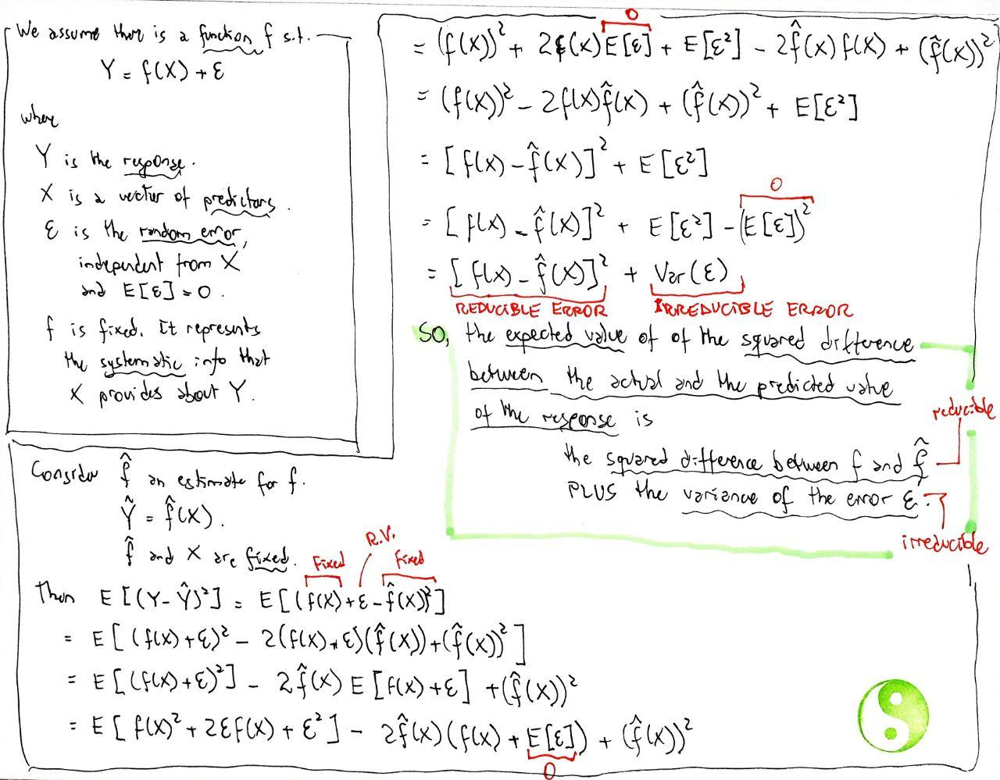
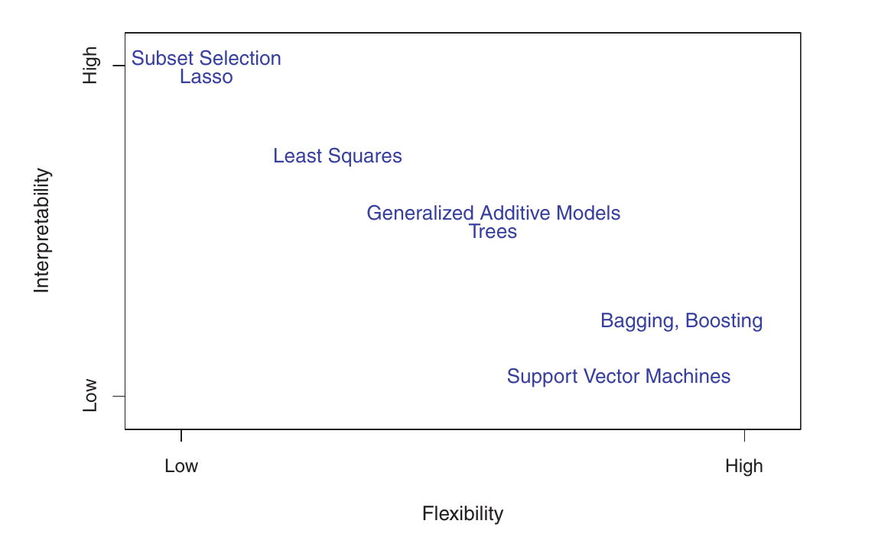

# 2 Statistical Learning {-}
 
## 2.1 What is statistical learning? {-}

### 2.1.1 Why estimate $f$? {-}
 
#### Reducible $\times$ irreducible error {-}

{ style="width: 100%" .center}

### 2.1.3 The trade-off between prediction accuracy and model interpretability {-}

{ style="width: 90%" .center}

