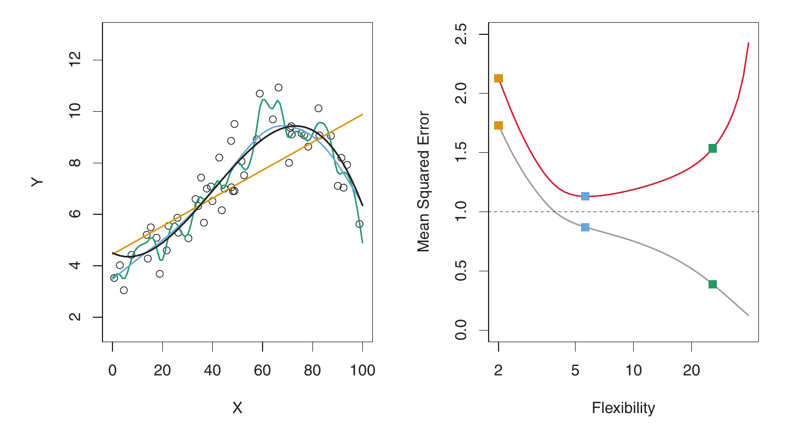

# 2 Statistical Learning {-}
 
## 2.1 What is statistical learning? {-}

### 2.1.1 Why estimate $f$? {-}
 
#### Reducible $\times$ irreducible error {-}

{ style="width: 100%" .center}

### 2.1.3 The trade-off between prediction accuracy and model interpretability {-}

{ style="width: 90%" .center}

### The curse of dimensionality {-}

In [Chapter 3](#linear-regression) and in the [exercises for Chapter 4](#classification), there is a discussion about why averaging the neighbors of a data point $\vec{x}$ to calculate $\hat f(\vec x)$ is not a good idea.

The problem is that in higher dimensions, the "neighbors" are not so local anymore, as the following exercise shows.

::: {.rmdbox}

* Imagine we have a cube with a volume of $1$ in $p$ dimensions. 

* We want to build a smaller cube in this space with $10\%$ of the original volume.

* What is the length of the edge of this smaller cube?

:::


#### $p = 1$ {-}

* In this case, the "volume" is a line segment with length $1$.

* Our smaller "cube" will have edge length $1/10$.


#### $p = 2$ {-}

* In this case, the "volume" is a square with side length $1$.

* The smaller "cube" will have "volume" $1/10$, which gives a square with side length $1/\sqrt{10} = `r 1/sqrt(10)`$.


#### $p = 3$ {-}

* In this case, the volume is a cube with edge length $1$.

* The smaller cube will have volume $1/10$, which gives edge length $1/\sqrt[3]{10} = `r 1/10^(1/3)`$.


#### $p = 4$ {-}

* In this case, the volume is a hypercube with "edge" length $1$.

* The smaller hypercube will have volume $1/10$, which gives a hypercube with "edge" length $1/\sqrt[4]{10} = `r 1/10^(1/4)`$.


#### In general {-}

* In $p$ dimensions, for a smaller cube having a fraction $x$ of the volume of the original, the edge length will be $\sqrt[p]{x}$.

* Graphically:

    ```{r echo=FALSE}
    el <- function(x, p) { (x)^(1/p) }
    max_perc <- .2
    
    p <- c(1, 2, 3, 4, 6, 10)
    
    curves <- p %>% 
      map(
        ~stat_function(
          mapping = aes(color = factor(.x)),
          fun = el,
          args = list(p = .x),
          geom = 'line',
          show.legend = FALSE
        )
      )
    
    ggplot() +
      curves +
      scale_x_continuous(
        limits = c(0, max_perc),
        expand = c(0,0)
      ) +
      scale_y_continuous(
        sec.axis = sec_axis(
          ~.,
          name = 'dimensions',
          breaks = el(max_perc, p),
          labels = paste('p =', p)
        )
      ) +
      labs(
        title = 'The curse of dimensionality',
        subtitle = 'Length needed along each axis to cover fraction of total volume\nof hypercube with edge length 1',
        x = 'fraction of total volume',
        y = 'length\nneeded'
      )
    ```

::: {.rmdcaution}

### Moral: {-}

In high dimensions, locality does not exist: even the smallest volumes require long distances.

:::


## 2.2 Assessing model accuracy {-}

```{r echo=FALSE, results='asis', out.extra=center()}
embed_yt('VusKAosxxyk')
```


### 2.2.1 Measuring the quality of fit {-}

#### Mean squared error (MSE) {-}

$$
MSE = \frac1n \sum_{i=1}^n [y_i - \hat f(x_i)]^2
$$

* This is the mean of the squared residuals.

* If this is small on training data, it may be a sign of overfitting.

* Better compute this on test data.

* [Cross-validation]{.hl} will set aside part of the data for testing.

* A trade-off between MSE and flexibility: more flexible models tend to overfit.

  { style="width: 90%" .center }

* Flexibility has to do with the number of [degrees of freedom]{.hl}.


### 2.2.2 The bias-variance trade-off {-}

* Suppose we have a model fitted using training data $Tr$, giving us $\hat f$.

* Now we have a test observation $(x_0, y_0)$ from the population.

* The true function is $Y = f(X) + \varepsilon$, with $f(x) = E(Y \mid X = x)$.

* We want to compute the test MSE:

  $$
  E\left[(y_0 - \hat f(x_0))^2\right]
  $$
  
* We are averaging over many possible $\hat f$ functions, each one the result of training the model using a different training set. So $x_0$ and $y_0$ are fixed.

* The MSE will have the following components:

  * The irreducible error, as before: $\text{Var}(\varepsilon)$.
  
  * The variability of $\hat f(x_0)$, depending on the training data: $\text{Var}(\hat f(x_0))$. This does not take into consideration the correct response $y_0$. This is called the [variance]{.hl}.
  
  * The squared [bias]{.hl} of $\hat f(x_0)$: $\left[ E(\hat f(x_0)) - f(x_0) \right]^2$. The bias averages over all possible training sets. It measures the difference between the average value of $\hat f(x_0)$ and the true value of $f(x_0)$.
  
* The more flexible the model, the greater the variance of $\hat f(x_0)$, because it is heavily affected by the training data. 

* The more flexible the model, the smaller the bias of $\hat f(x_0)$, because [although $\hat f(x_0)$ varies a lot, depending on the training set --- in fact, precisely *because* it varies in sync with the training data --- its average is close to $f(x_0)$.]{.hl}

* So the expected MSE (over all possible training sets) is

  $$
  E\left[(y_0 - \hat f(x_0))^2\right] = 
    \text{Var}(\hat f(x_0)) + \left[ E(\hat f(x_0)) - f(x_0) \right]^2 +
    \text{Var}(\varepsilon)
  $$

* The overall expected test MSE is computed by averaging the above over all possible values of $x_0$ in the test set.


### 2.2.3 The classification setting {-}


## 2.4 Exercises {-}

